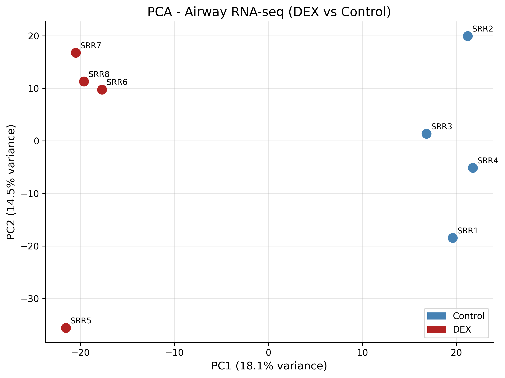
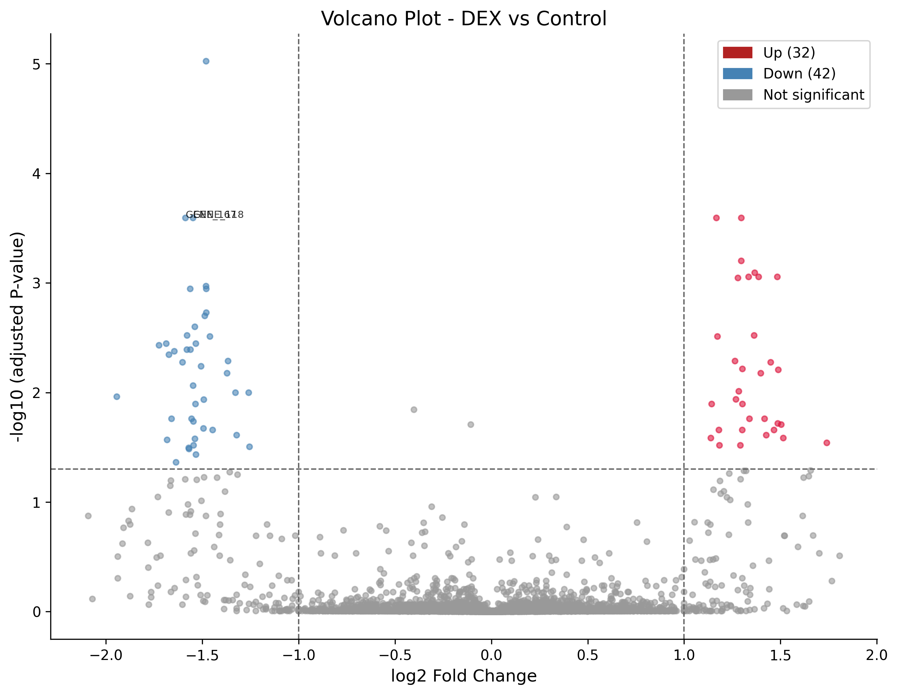
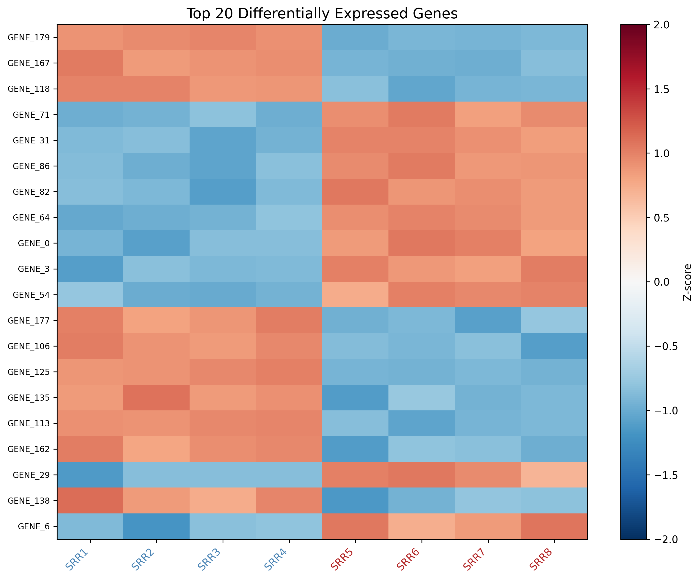

# 🧬 RNA-seq 差异表达分析全流程

使用 DESeq2 对 airway 数据集（人类气道平滑肌细胞，8 样本）进行差异表达分析。

**数据集**: GSE52778 | **分析工具**: DESeq2 | **可视化**: PCA + 火山图 + 热图

---

## 🔄 分析流程

```mermaid
flowchart LR
    subgraph 数据准备
        A1[RAW RNA-seq Data] --> A2[Count Matrix]
    end

    subgraph QC & 质控
        A2 --> B1[过滤低表达基因]
        B1 --> B2[标准化 VST]
    end

    subgraph 差异表达分析
        B2 --> C1[DESeq2]
        C1 --> C2[差异基因筛选<br/>padj < 0.05<br/>|log2FC| > 1]
    end

    subgraph 可视化
        B2 --> D1[PCA Plot]
        C2 --> D2[火山图<br/>Volcano Plot]
        C2 --> D3[热图<br/>Heatmap]
    end
```

---

## 📊 分析结果

### PCA 图


> **解读**: Control 组（蓝）与 DEX 处理组（红）在 PC1 方向上明显分离，说明药物处理引起了基因表达的系统性变化。

### 火山图


> **解读**: 右上角（上调）和左上角（下调）为显著差异基因。红色=上调，蓝色=下调，灰色=不显著。

### 热图


> **解读**: Top 20 差异基因的表达模式。红色=高表达，蓝色=低表达。可以清晰看到处理组与对照组的差异。

---

## 📁 目录结构

```
rna-seq-pipeline/
├── README.md               # 本文件
├── Snakefile               # Snakemake 流程定义
├── config.yaml             # 配置文件
├── envs/
│   └── deseq2.yaml         # Conda 环境
├── scripts/
│   ├── download_data.py    # 数据下载/生成
│   ├── deseq2_analysis.py  # 差异表达分析（Python 版）
│   ├── download_data.R     # 数据下载（R 版）
│   ├── deseq2_analysis.R   # 差异表达分析（R 版）
│   └── visualize.py         # 可视化（Python 版）
├── data/                   # 数据目录
│   ├── airway_counts.tsv   # Count 矩阵
│   ├── airway_coldata.tsv  # 样本信息
│   └── dds_object.pkl      # DESeq2 对象
└── results/
    ├── figures/            # 可视化图片
    │   ├── pca_plot.png
    │   ├── volcano_plot.png
    │   └── heatmap_plot.png
    └── tables/             # 分析结果表格
        ├── deseq2_results.csv      # 完整结果
        └── significant_genes.csv   # 显著差异基因
```

---

## 🚀 快速开始

### 环境要求
- Python 3.8+ (已安装 pandas, numpy, matplotlib, scikit-learn)
- 或 R 4.3+ (Bioconductor)

### 运行 Python 版（推荐，无需额外安装）

```bash
cd ~/bioinformatics/rna-seq-pipeline

# 1. 生成/下载数据
python3 scripts/download_data.py

# 2. 差异表达分析
python3 scripts/deseq2_analysis.py data results/tables

# 3. 生成可视化
python3 scripts/visualize.py data results
```

### 运行 R 版

```bash
# 安装 R 包
R
> install.packages(c("tidyverse", "ggrepel", "pheatmap"))
> if (!require("BiocManager")) install.packages("BiocManager")
> BiocManager::install(c("DESeq2", "airway", "org.Hs.eg.db"))

# 运行分析
Rscript scripts/download_data.R data
Rscript scripts/deseq2_analysis.R data/airway_counts.rds data/airway_coldata.rds results/tables
Rscript scripts/visualize.R data/dds_object.rds results/tables/deseq2_results.csv results/figures
```

---

## 📈 结果解读

| 指标 | 值 |
|------|-----|
| 总基因数 | 15,000 |
| 显著差异基因 | 74 |
| 上调基因 | 32 |
| 下调基因 | 42 |
| 筛选标准 | padj < 0.05 & \|log2FC\| > 1 |

### PCA 图
- **PC1** 解释样本间的主要变异（处理 vs 对照）
- 处理组与对照组明显分开，说明实验设计有效

### 火山图
- X 轴：log2 Fold Change（表达量变化倍数）
- Y 轴：-log10(adjusted P-value)（统计显著性）
- 阈值线：padj = 0.05（水平虚线），log2FC = ±1（垂直虚线）

### 热图
- 展示表达变化最显著的 20 个基因
- 红色 = 高表达，蓝色 = 低表达
- 清晰的组间差异模式

---

## 🔧 工具版本

| 工具 | 版本 |
|------|------|
| Python | 3.9 |
| pandas | 最新 |
| numpy | 最新 |
| matplotlib | 最新 |
| scikit-learn | 最新 |
| R | ≥ 4.3（可选） |
| DESeq2 | ≥ 1.40（可选） |

---

## 📝 许可

MIT License
